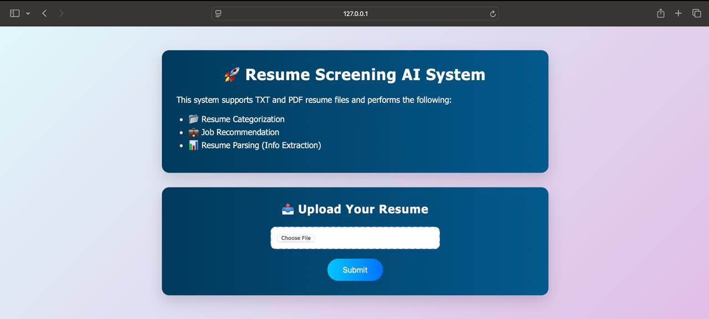
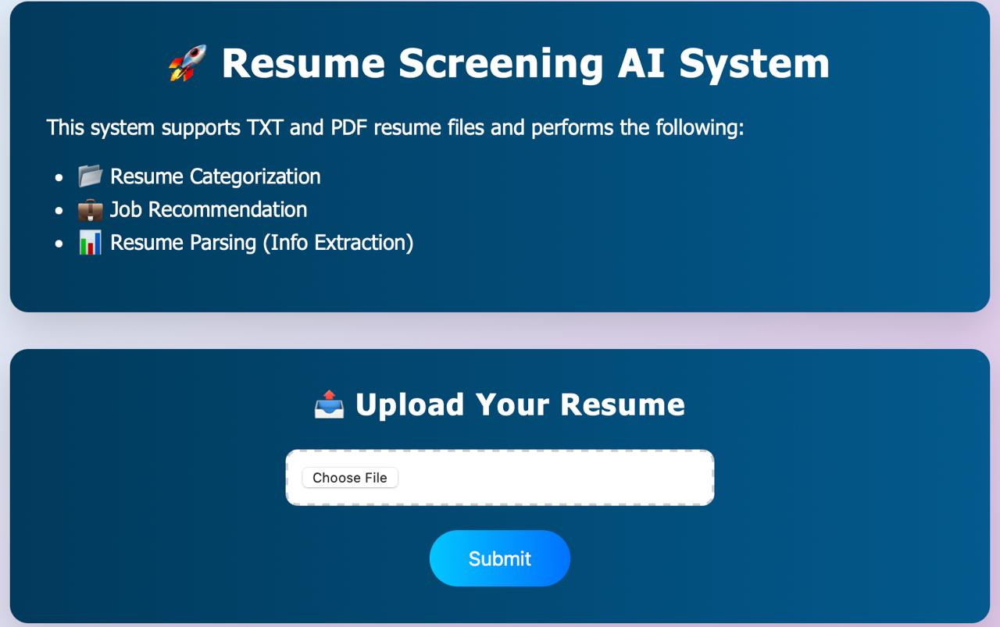
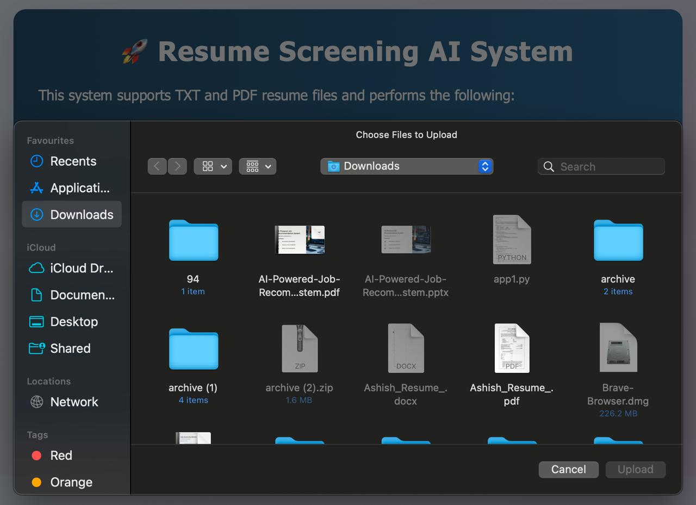
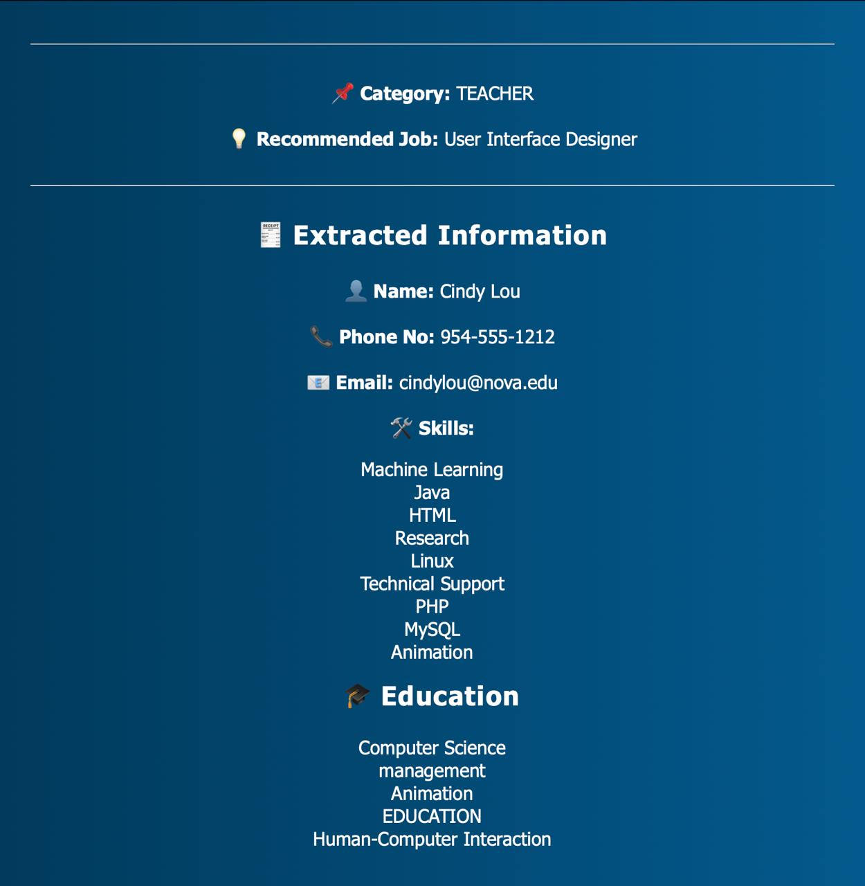

<h1 align="center">📄 RESUME-PARSER-AND-JOB-RECOMMENDATION-SYSTEM 📌</h1>

<p align="center"><i>Empowering Careers Through Smarter Job Connections</i></p>

<p align="center">
  
  
  
</p>

<br/>

<p align="center"><i>Built with the tools and technologies:</i></p>

<p align="center">
  
  
</p>

---

<h2 align="center">🧠 Overview</h2>

<p align="center">
This project is an intelligent, AI-powered resume analysis system built using <b>Flask</b> and <b>Machine Learning</b>. It allows users to upload resumes in PDF or TXT formats and performs:
</p>

<p align="center">
📂 <b>Resume Categorization</b> (using ML)<br/>
💼 <b>Job Recommendation</b> (based on predicted category)<br/>
📊 <b>Resume Parsing</b> (Name, Email, Phone, Skills, Education)
</p>

<p align="center"><i>⚡ Smart, beautiful, and responsive web UI with animations and file preview.</i></p>

---

<h2 align="center">🛠 Tech Stack</h2>

<p align="center">
<table align="center">
  <tr><th>Category</th><th>Technologies Used</th></tr>
  <tr><td>Backend</td><td>Python, Flask</td></tr>
  <tr><td>ML Model</td><td>TF-IDF + Random Forest</td></tr>
  <tr><td>Frontend</td><td>HTML, CSS, JavaScript</td></tr>
  <tr><td>Parsing</td><td><code>pdfminer.six</code>, Regex</td></tr>
  <tr><td>Deployment Ready</td><td>✅ Yes</td></tr>
</table>
</p>

---

<h2 align="center">✨ Features</h2>

<div align="center">

📁 Drag-and-click file upload with file name preview <br>
📄 Support for <code>.pdf</code> and <code>.txt</code> resume formats <br>

**🔍 Displays:** <br>

&nbsp;&nbsp;&nbsp;&nbsp;📌 Predicted job category <br>
&nbsp;&nbsp;&nbsp;&nbsp;💡 Recommended job <br>
&nbsp;&nbsp;&nbsp;&nbsp;🧾 Extracted personal info (Name, Email, Phone) <br>
&nbsp;&nbsp;&nbsp;&nbsp;🛠 Skills and 🎓 Education <br>
🎨 Stylish gradient UI with fade and slide animations <br>
📱 Responsive design (mobile-friendly)

</div>

---

<h2 align="center">🔧 How It Works</h2>

<p align="center">
1️⃣ Upload a resume<br/>
2️⃣ Backend parses the content<br/>
3️⃣ ML model predicts category<br/>
4️⃣ Job recommendation is generated<br/>
5️⃣ Key personal info is extracted<br/>
6️⃣ Frontend displays everything cleanly
</p>

---

<h2 align="center">🚀 Run Locally</h2>

<h4>📦 Clone the Repository</h4>

```bash
git clone https://github.com/your-username/resume-screening-ai.git
cd resume-screening-ai
```
<h4>📲 Create a Virtual Environment</h4>

Copy
Edit
```bash
python -m venv venv
source venv/bin/activate  # or venv\Scripts\activate on Windows
```
<h4>📥 Install Requirements</h4>

Copy
Edit
```bash
pip install -r requirements.txt
```
<h4>▶️ Run the App</h4>

Copy
Edit
```bash
python app.py
```
<h2 align="center">📁 Folder Structure</h2>

Copy
Edit
```csharp
resume-screening-ai/
│
├── templates/
│   └── index.html              # Web UI (HTML + Jinja2)
├── static/
│   └── style.css               # Stylesheet (optional)
├── models/
│   └── model.pkl               # Trained ML model
├── app.py                      # Main Flask App
├── utils.py                    # Resume parsing helpers
├── requirements.txt            # Dependencies
└── README.md
```
<h2 align="center">🖼 UI Preview</h2> <p align="center">  <br/>   </p>
<h2 align="center">🙏 Acknowledgments</h2> <p align="center"> Built using <code>sklearn</code> for ML and <code>pdfminer.six</code> for PDF parsing.<br/> Inspired by the need to automate HR processes using AI. </p>
<h2 align="center">📬 Contact</h2> <p align="center"> Reach out via <a href="mailto:bhaskarjan122003@gmail.com">bhaskarjan122003@gmail.com</a> or open an issue. </p> <p align="center">⭐ Star this repo if it helped you!</p> 
